- [说明](#说明)
  - [依赖库](#依赖库)
  - [项目结构](#项目结构)
- [main.py](#mainpy)
  - [接口](#接口)
    - [IMUTracker类](#imutracker类)
  - [使用](#使用)
  - [示例](#示例)
  - [流程图](#流程图)
- [plotlib.py](#plotlibpy)
  - [接口](#接口-1)
  - [示例](#示例-1)

# 说明

## 依赖库
- numpy
- scipy
- matplotlib

## 项目结构
- `main.py`：主算法，带有一个从手机接收数据并可视化的示例。每次运行会自动保存数据到`data.txt`中，`receive_data()`的参数设为`mode='file'`即可从文件读取。
- `plotlib.py`：可视化的简单封装。
- `mathlib.py`：矩阵操作和滤波器的封装。
- `butter.py`：实时巴特沃斯滤波器，详情见[这里](https://github.com/keikun555/Butter)。目前没有使用。
- `main.ipynb`：开发使用。
- `/Ref`：
  - *Using Inertial Sensors for Position and Orientation Estimation*是一个基本教程，包含了卡尔曼滤波的较为详细的描述。
  - 其它为修正算法相关文献。


# main.py

## 接口
### IMUTracker类
- `__init__(self, sampling, data_order={'w': 1, 'a': 2, 'm': 3})`
  - `sampling`
    - 采样率，单位：Hz。
  - `order`
    - 数据的顺序，角速度为`w`、加速度为`a`、磁力计为`m`，默认为：`{'w': 1, 'a': 2, 'm': 3}`。


- `initialize(self, data, noise_coefficient={'w': 100, 'a': 100, 'm': 10})`

    返回一个list，包含EKF算法需要的所有初始化值。

  - `data`
    - 传感器数据，$(n\times 9)$numpy数组。
    - 有时传感器刚开始测量时会产生无用的数据，可能需要预处理去掉明显不符合实际的数据点，如去掉刚开始测量时的前10个点。
  - `noise_coefficient`
    - 传感器噪声值包括了实际噪声和测量误差，噪声由初始化数据的方差算出，然后乘上一个系数作为算法中的传感器噪声。
    - 这个值越大，代表算法越不信任传感器，那么在滤波补偿时就会减小这个传感器的权值。


- `attitudeTrack(self, data, init_list)`

    使用Extended Kalman Filter(EKF) 计算姿态，算法描述在`/Doc/Algorithm Description.html`。返回地面坐标系下的加速度（去除了重力成分）和设备朝向。
    
    朝向由3个$n\times 3$numpy数组表示，分别是$XYZ$轴的方向向量（单位向量），设备初始状态是：
    $$\hat{x}=[1,0,0]^T\ \hat{y}=[0,1,0]^T\ \hat{z}=[0,0,1]^T$$

    绕$Z$轴右手方向旋转$90\degree$后：
    $$\hat{x}=[0,1,0]^T\ \hat{y}=[-1,0,0]^T\ \hat{z}=[0,0,1]^T$$


    - `data`
      - 传感器数据，$(n\times 9)$numpy数组。
    - `init_list`
      - 初始化值列表，可以直接使用`initialize`的返回值，也可自定义。
      - 顺序：
        - 地面坐标系重力向量
        - 重力大小
        - 磁场方向**单位**向量
        - 陀螺仪噪声
        - 陀螺仪偏差
        - 加速度计噪声
        - 地磁计噪声


- `removeAccErr(self, a_nav, threshold=0.2, filter=False, wn=(0.01, 15))`

    假设设备测量前后都静止，去除地面坐标系加速度的偏差，并通过一个带通滤波器（可选）。返回修正后的加速度数据。

  - `a_nav`
    - 地面坐标系加速度数据，$(n\times 3)$numpy数组。
  - `threshold`
    - 检测静止状态的加速度阈值，不建议太低。
  - `filter`
    - 滤波开关。
    - 低通滤波去除毛刺，高通滤波去除直流分量（固定的偏差），但有时滤波会起反作用，应视实际情况使用。
  - `wn`
    - 滤波器的截止频率。


- `zupt(self, a_nav, threshold)`

    使用Zero velocity UPdaTe算法来修正速度。返回修正后的速度数据。

    - `a_nav`
      - 地面坐标系加速度数据，$(n\times 3)$numpy数组。
    - `threshold`
      - 检测静止状态的加速度阈值，运动越激烈阈值应越高。
  

- `positionTrack(self, a_nav, velocities)`

    使用加速度和速度进行积分得到位移。返回位移数据。

    - `a_nav`
      - 地面坐标系加速度数据，$(n\times 3)$numpy数组。
    - `velocities`
      - 地面坐标系速度数据，$(n\times 3)$numpy数组。


## 使用
1. 初始化`IMUTracker`类
2. 将初始化数据输入`initialize`方法
3. 将`initialize`返回的list，同传感器数据一起传入`attitudeTrack`方法
4. 使用`removeAccErr`方法修正`attitudeTrack`返回的加速度数据
5. 使用`zupt`方法计算速度
6. 使用`positionTrack`方法对速度和加速度数据进行积分，得到位移

## 示例
```python
data = sensor.getData()
tracker = IMUTracker(sampling=100)

# init
init_list = tracker.initialize(data[5:30])
# EKF
a_nav, orix, oriy, oriz = tracker.attitudeTrack(data[30:], init_list)
# filter a_nav
a_nav_filtered = tracker.removeAccErr(a_nav, filter=False)
# get velocity
v = tracker.zupt(a_nav_filtered, threshold=0.2)
# get position
p = tracker.positionTrack(a_nav_filtered, v)
```

## 流程图
<div align=center>
    
</div>


# plotlib.py

## 接口
- `plot3(data, ax=None, lims=None, labels=None, show=False, show_legend=False)`

    接受多个$(n\times 3)$的数据，如$XYZ$方向加速度，将3个分量分别画在3张图中。默认不设置其他参数。返回使用的matplotlib axes对象。

    - `data`
      - 包含数据的列表：`[data1, data2, ...]`。每个元素都是$(n\times 3)$的numpy数组。
    - `ax`
      - matplotlib axes对象，默认单独创建。
    - `lims`
      - 坐标上下限：`[[[xl, xh], [yl, yh]], ...]`。
      - 嵌套了3层。
    - `labels`
      - 图例所用的标签：`[[x_label1, y_label1, z_label1], [x_label2, y_label2, z_label2], ...]`。
      - 与`data`中数据一一对应。
    - `show`
      - 是否调用`plt.show()`，用处不大可以忽略。
    - `show_legend`
      - 是否显示图例，如果不定义标签则显示空图例。
      - 有时图例会遮挡曲线，所以为了方便，单独定义了这个开关。

- `plot3D(data, lim=None, ax=None)`
  
    接受多个$(n\times 3)$的数据，画出3维图像。

  - `data`
    - 包含数据的列表：`[[data1, label1], [data2, label2], ...]`。
    - 这里不太一样的是强制要求定义标签。
  - `lim`
    - $XYZ$轴的上下限：`[[xl, xh], [yl, yh], [zl, zh]]`。
    - 单个轴设为`None`则使用默认值，如：`[[xl, xh], [yl, yh], None]`。
  - `ax`
    - 画图使用的matplotlib axes对象，用户一般不需要设置。

- `plot3DAnimated(data, lim=[[-1, 1], [-1, 1], [-1, 1]], label=None, interval=10, show=True, repeat=False)`

  生成一个3D动画。

  视角调整比较麻烦，见[axes3d.view_init](https://matplotlib.org/mpl_toolkits/mplot3d/api.html#mpl_toolkits.mplot3d.axes3d.Axes3D.view_init)。

  如果需要保存动画，则需要ffmpeg库，然后使用`ani.save()`，见[matplotlib文档示例](https://matplotlib.org/gallery/animation/basic_example_writer_sgskip.html)。

  - `data`
    - $(n\times 3)$numpy数组。
  - `lim`
    - 坐标轴范围。
    - 这个不会随数据自动设置，最好要手动指定。
  - `label`
    - 图例标签，字符串。
  - `interval`
    - 帧之间的时长，单位：ms
  - `show`
    - 控制是否调用`plt.show()`。
    - 如果不调用，则可以多次调用这个函数，在同一张图中画出多条曲线。最后需要手动调用`plt.show()`
  - `repeat`
    - 控制动画是否循环。


## 示例

直接输入数据即可画图：
```python
plot3([acc1, acc2])
plot3D([[position, 'position'], [orientation, 'orientation']])
```

`plot3()`默认使用3行布局，也可以使用3列布局：
```python
import matplotlib.pyplot as plt
fig, ax = plt.subplots(nrows=1, ncols=3)
plot3([acc1, acc2], ax=ax)
```
